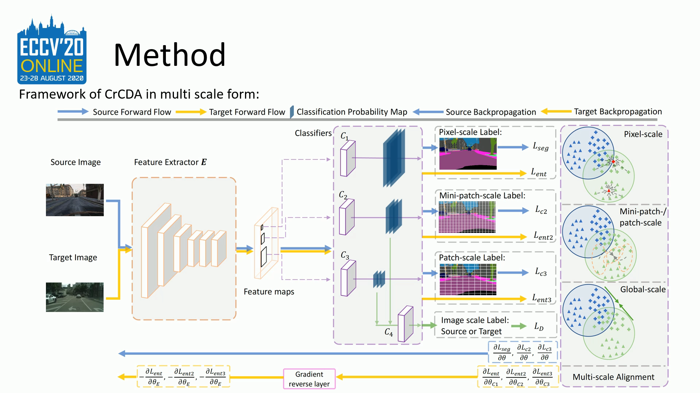

# CrCDA

Unofficial Implementation of [Contextual-Relation Consistent DomainAdaptation for Semantic Segmentation](https://arxiv.org/pdf/2007.02424.pdf)

Based on [AdvEnt](https://github.com/valeoai/ADVENT.git).
